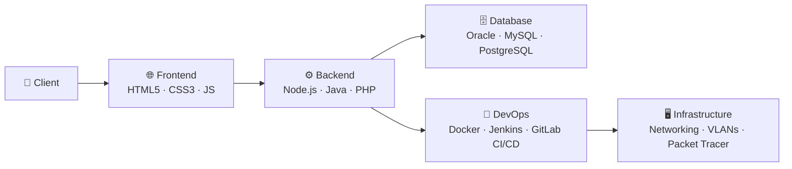

<div align="center">


[](https://git.io/typing-svg)

</div>

---

## 👨‍💻 About Me

```yaml
name: Alejo Vargas
alias: ImAlejovar
role: Software Engineering Student
focus: Fullstack Development + DevOps + Networking
education: Software Engineering (In Progress)
content: Live Coding on Twitch & Instagram
motto: "Ship it. Break it. Fix it. Repeat."
```

---

## 🧩 Skills Matrix

### 🎨 Frontend
<div align="center">

[](https://skillicons.dev)

</div>

### ⚙️ Backend
<div align="center">

[](https://skillicons.dev)

</div>

### 🗄️ Databases
<div align="center">

[](https://skillicons.dev)

</div>

### 🚀 DevOps & Tools
<div align="center">

[](https://skillicons.dev)

</div>

### 🌐 Networking
<div align="center">

| Skill | Level |
|:------|:------|
| Network Architecture & Protocols | ████████░░ Advanced |
| Cisco Packet Tracer | ████████░░ Advanced |
| TCP/IP, DNS, DHCP, VLANs | ███████░░░ Solid |
| Network Security Fundamentals | ██████░░░░ Intermediate |

</div>

---

## 📊 GitHub Stats

<div align="center">


</div>

<div align="center">

[](https://git.io/streak-stats)

</div>

<div align="center">

[](https://github.com/ashutosh00710/github-readme-activity-graph)

</div>

---

## 📡 Live Coding & Socials

<div align="center">

[](https://www.twitch.tv/ImAlejovar)
[](https://www.instagram.com/ImAlejovar)
[](https://github.com/ImAlejovar)

</div>

---

## 🏗️ Tech Stack Overview

<div align="center">



</div>

---

<div align="center">


*⚡ Live coding on [Twitch](https://www.twitch.tv/ImAlejovar) & [Instagram](https://www.instagram.com/ImAlejovar) — come build with me!*

</div>
